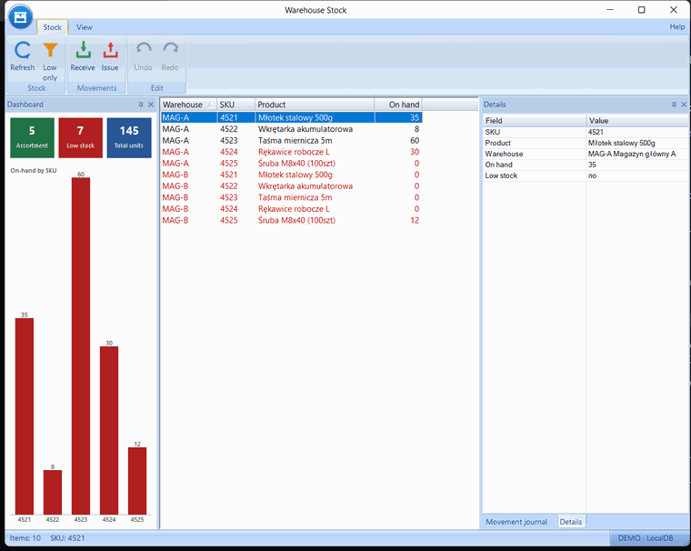
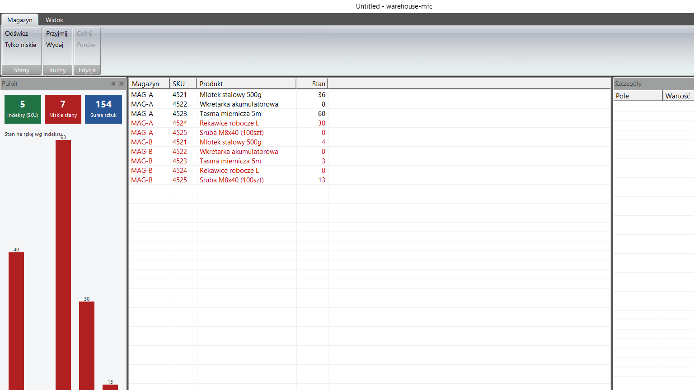
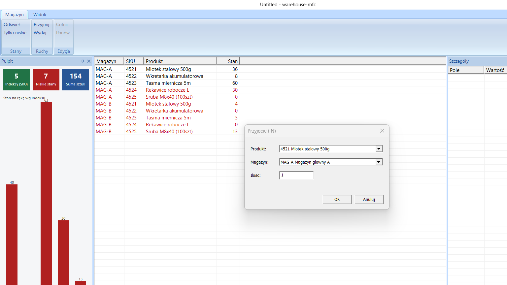

# Warehouse MFC

[](https://github.com/makflint/warehouse-mfc/actions/workflows/ci.yml)
[](LICENSE)

A small but real **MFC + SQL Server (LocalDB)** desktop app: warehouse stock & movements with a modern
**MFC Feature Pack** UI (ribbon, dockable panes, themed dashboard) and **undo/redo** (Command
pattern). A demo of **MFC / Windows desktop** application development.

> **What works today:** a complete, runnable app. Browse live stock (on-hand summed from a movement
> log, low-stock rows in red), record stock movements through a DDX/DDV dialog, and **undo/redo** every
> change (Ctrl+Z / Ctrl+Y). A **ribbon** UI with dockable **Details** / **Movement-log** panes, a
> **dark mode**, and an owner-drawn **dashboard** (KPI tiles + bar chart that repaints live). Ships
> **bilingual** (Polish / English) and installs from a **one-click installer** that needs nothing
> preinstalled. The GUI-free C++ core is **TDD'd at 100% line coverage**.



<sub>UI shown in English; the app also ships in Polish — [same demo, Polish UI](docs/screenshots/demo.gif). Product/warehouse names stay Polish by design (they're DB data).</sub>

## What it demonstrates
- **MFC**: SDI doc/view, list-view grid, dialogs with DDX/DDV.
- **MS SQL Server**: real schema, a **view** and a **stored procedure with a transaction**.
- **Design patterns**: **Command** pattern for undo/redo.
- **Testable core**: domain logic (stock math, the Command/undo stack) lives in a pure C++
  `core/` static lib with **TDD** (Catch2), verified without a GUI.
- **Modern MFC (M8)**: an MFC **Feature Pack** UI — `CMFCRibbonBar`, dockable panes,
  visual-manager themes (dark mode), and an owner-drawn **dashboard** (KPI tiles + bar chart).
- **Bilingual & Unicode-correct**: the UI ships in **Polish *and* English**. A small string
  catalog (`I18n`) picks the language from the **Windows UI language** on first run, with a
  **Język / Language** toggle in the ribbon (applied on restart). Data (product/warehouse names)
  and the SQL Server error text stay Polish by design. Full diacritics end-to-end: UTF-8
  `.cpp`/`.rc` resources and wide ODBC (`SQLExecDirectW`, `N'…'` literals, `NVARCHAR`); the seed
  names (*Młotek*, *Wkrętarka*, *Śruba*…) round-trip cleanly to the UI.

## Screenshots


The MFC **Feature Pack** UI: a `CMFCRibbonBar` with icon glyphs (*Magazyn* / *Widok* tabs), an
owner-drawn **Pulpit** (dashboard) pane with KPI tiles + an on-hand bar chart, the stock grid (with
low-stock rows in red and proper Polish names), the **Szczegóły** / **Dziennik ruchów** panes sharing
one **tab group**, and a `CMFCRibbonStatusBar` (row count · selected symbol · connection profile).

| Dark theme (Widok → Motyw → Ciemny) | Record movement (DDX/DDV) |
|---|---|
|  |  |

On-hand is summed from the movement log; rows at/below the reorder level are drawn red. Recording
a movement runs through the **Command** stack (undo/redo, Ctrl+Z/Ctrl+Y) and the dashboard
repaints live.

## Architecture
Three layers with hard boundaries — the testable logic is isolated from the GUI so it can be
TDD'd without one. Dependencies point downward; no business rules live in `app/`.

```
app/    MFC Feature Pack — doc/view, ribbon, dockable panes, owner-drawn
        dashboard, DDX/DDV dialogs, i18n catalog, visual-manager themes
  │     (wires the layers below; holds no business logic)
  ▼
data/   thin ODBC — StockRepository (pImpl) over vCurrentStock + sp_RecordMovement
  │
  ▼
core/   pure C++17 (no MFC / ODBC / Windows) — stock math, the Command/undo
        stack, grid-sort & error-cleaning logic · unit-tested (Catch2, 100% lines)
```

- **[`core/`](core/include/warehouse/)** — domain only: `MovementCommand` + `CommandStack`
  (undo/redo via *compensating* movements), `StockMath`, grid-sort / dialog-preselect
  (`view_logic.hpp`), ODBC-error cleaning (`db_error.hpp`). No framework headers → tested without a GUI.
- **[`data/`](data/include/warehouse/)** — `StockRepository` (pImpl) is a thin ODBC wrapper over the
  view + stored proc; connection string from `connection_profiles.hpp`.
- **[`app/`](app/)** — MFC UI; wires `core` + `data`. Pushing the logic into a GUI-free `core/` is
  what makes the TDD + 100% coverage possible.

## C++ / Windows techniques on show
| Area | What |
|---|---|
| **Patterns** | **Command** (undo/redo, compensating ops) · **pImpl** (`StockRepository`) · RAII + clear ownership (`std::unique_ptr`, MFC `CDC`/`CFont`) · enforced layer boundaries |
| **MFC Feature Pack** | `CMFCRibbonBar`, `CDockablePane`, `CMFCListCtrl`, `CMFCPropertyGridCtrl`, `CMFCVisualManager` (incl. a custom **dark** manager) · owner-drawn, double-buffered dashboard · DWM dark title bar |
| **Data / SQL** | ODBC **wide** API (`SQLExecDirectW`, `NVARCHAR`, `N'…'`) Unicode round-trip · a **view** + a **stored proc with a transaction** (`UPDLOCK/HOLDLOCK`, `THROW` on overdraw) |
| **i18n** | PL/EN string catalog with **compile-time** consistency (`static_assert` on a deduced table size) |
| **Testing** | **TDD** (Catch2; **100%** `core/` line coverage via OpenCppCoverage) · cross-process **UI Automation + Win32** assertion suite · scripted visual sweep |
| **Tooling** | `/W4 /WX` (MFC headers external-silenced) · **clang-tidy** clean · one-command local CI ([`run-tests.ps1`](run-tests.ps1)) |

## SQL Server connection (one switch)
The app talks to **SQL Server over ODBC** only (no web/HTTP in C++). It ships pointed at
**LocalDB** — zero-config, and it **self-seeds on first run**. LocalDB *is* the SQL Server engine
(identical T-SQL, view, stored proc, ODBC driver), so pointing at a full instance — a LAN box, a
**VPS over Tailscale**, Azure SQL — changes **only the `Server=` part** of the connection string in
[`connection_profiles.hpp`](data/include/warehouse/connection_profiles.hpp); nothing else moves.

| | DEMO — shipped | Full server — the switch |
|---|---|---|
| DB | SQL Server LocalDB (zero-config, seeded) | SQL Server on a box / VPS / Azure |
| Connection | `Server=(localdb)\MSSQLLocalDB;Trusted_Connection=yes` | `Server=<host>;UID=…;PWD=…` |
| Install | one-click **MSI** (Inno Setup) | manual |

Everything in this repo runs against **LocalDB** (the app, `data_smoke`, the `tests/ui` suite,
coverage); the full-server column is the documented one-line switch, not a second profile that's
exercised here.

## Getting started

### 1. Prerequisites (all free)
1. **Visual Studio Community 2022** → workload *"Desktop development with C++"* + optional
   component **"C++ MFC for latest v143 build tools"**.
2. **SQL Server 2022 Express** (includes **LocalDB**) + **SSMS**.

That's all you need to build, run and test the app. *Optional:* the visual sweep's **AI review**
(`run-tests.ps1 -AiReview`) shells out to the [`claude`](https://claude.com/claude-code) CLI to
eyeball the screenshots — it is **not** a prerequisite; without it the sweep is just reviewed by
eye and every test gate still runs.

### 2. One command (build → test → installer)
From zero — build (Debug + Release) → run the test gates → produce the installer:
```powershell
git clone https://github.com/makflint/warehouse-mfc.git
cd warehouse-mfc
powershell -File release.ps1            # add -NoSweep to skip the slow visual sweeps
```
It stops **before** the installer if any test gate fails. What it emits:

| Artifact | Location |
|---|---|
| **Test results** | console — per-layer pass/fail; the run **exits non-zero on any failed gate** |
| **App binary** (Release · x64) | `app\x64\Release\app.exe` |
| **Installer** | `installer\Output\WarehouseMFC-Setup.exe` |

No publishing — push a GitHub release by hand with `gh` when you want one. The detailed,
step-by-step equivalents are below.

### 3. Build & run
Just hacking on it? Open `warehouse-mfc.sln` in **Visual Studio** (Release · x64, Ctrl+Shift+B, F5)
— the app **self-seeds its LocalDB database on first run**, so building and launching is enough.
Build + test only, no installer: `powershell -File run-tests.ps1 -Build`.

> *Optional manual seed* (the app does this itself on first run):
> ```powershell
> sqlcmd -S "(localdb)\MSSQLLocalDB" -i db\01_schema.sql
> sqlcmd -S "(localdb)\MSSQLLocalDB" -i db\02_seed.sql
> ```
> The SQL scripts are **UTF-8** (Polish diacritics); the first-run self-seed (`SQLExecDirectW`) and
> modern `sqlcmd` handle this natively — the classic SQL-tools `sqlcmd` needs `-f 65001`.

### 4. Test (local CI)
Three layers: **unit tests** for the GUI-free `core/` (TDD, Catch2); an **assertion-based UI
suite** ([`tests/ui/`](tests/ui/), Pester) that drives the running app and asserts on control
*state* via UI Automation (e.g. the dialog combos follow the selected grid row); and an
**exploratory harness** ([`tests/manual/`](tests/manual/)) that screenshots each step for the
genuinely visual cases (theming, owner-draw, resize). Full methodology + case list:
**[docs/TESTING.md](docs/TESTING.md)**.

Just the unit layer (fast, GUI-free):
```powershell
msbuild warehouse-mfc.sln /p:Configuration=Debug /p:Platform=x64 /t:core_tests
x64\Debug\core_tests.exe        # exit 0 = green
```

One script — [`run-tests.ps1`](run-tests.ps1) — runs every layer against LocalDB, resetting the DB
to a clean baseline and clearing the saved language first so the run is deterministic and
self-contained. The **exit code is the number of failed gating layers** (0 = all green).

| Layer | What | Gates? |
|---|---|---|
| `core_tests` | Catch2 unit tests (`core/`) | ✓ exit code |
| `data_smoke` | `data/` ODBC smoke vs LocalDB | ✓ exit code |
| `tests/ui` | Pester + UI-Automation state assertions | ✓ exit code |
| `sweep pl/en` | visual exploratory screenshots | informational (review by eye / `-AiReview`) |

```powershell
powershell -File run-tests.ps1                 # all layers (assumes already built)
powershell -File run-tests.ps1 -Build          # build Debug + Release first
powershell -File run-tests.ps1 -NoSweep        # gates only (skip the visual sweeps)
powershell -File run-tests.ps1 -Coverage       # also report core/ line coverage
powershell -File run-tests.ps1 -AiReview       # also AI-review the sweep shots (needs the `claude` CLI)
```
Only the three gating layers decide the exit code; the sweep is informational. `-AiReview` is
optional — it asks the `claude` CLI to eyeball the sweep screenshots, and is silently skipped if
the CLI isn't on PATH (see [docs/TESTING.md](docs/TESTING.md)).

### 5. Installer & download
**Download:** [release v1.1](https://github.com/makflint/warehouse-mfc/releases/tag/v1.1) →
`WarehouseMFC-Setup.exe`. Run it on a clean Windows machine — no prerequisites to install by hand.

An [Inno Setup](installer/warehouse-mfc.iss) script bundles the app, the SQL scripts and the
two runtime prerequisites (Visual C++ runtime + SQL Server LocalDB) and installs them silently.
The app **seeds its LocalDB database on first run**, so it works on a fresh machine. The one-command
`release.ps1` above builds it after the gates pass; to build just the installer from an existing
Release app:
```powershell
"%LOCALAPPDATA%\Programs\Inno Setup 6\ISCC.exe" installer\warehouse-mfc.iss
# -> installer\Output\WarehouseMFC-Setup.exe
```
> The binary assets (`vc_redist.x64.exe`, `SqlLocalDB.msi`) live under `installer/assets/`
> (gitignored) and must be present before compiling. The build is **unsigned**, so Windows
> SmartScreen will warn on first run ("More info" → "Run anyway").

See [docs/SPEC.md](docs/SPEC.md) for the design and [TODO.md](TODO.md) for the roadmap & open work.

## Author
Built by **Maciej Krzemiński**, using **Claude** generative-AI tooling — [Claude Code](https://claude.com/claude-code)
and Claude models (Anthropic) — throughout for design, code generation and tests.

## License
[MIT](LICENSE) © Maciej Krzemiński
