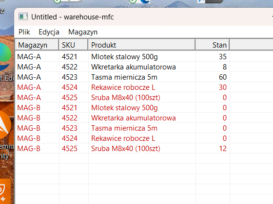
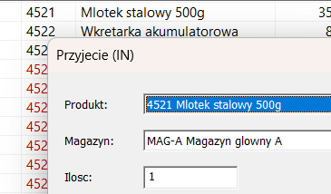
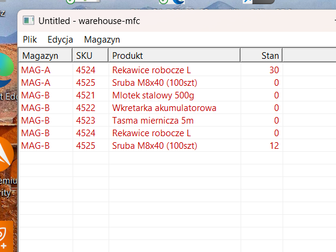

# warehouse-mfc

A small but real **MFC + SQL Server** desktop app: warehouse stock & movements, with
**hands-free Polish voice control** (offline speech-to-text + TTS) and **undo/redo**
(Command pattern). Built as a portfolio piece for a *Senior C++ Developer (MFC)* role.

> Status: **M0–M7 done** — DB, `core/` (TDD), `data/` (ODBC), MFC UI (undo/redo, low-stock),
> Polish TTS, one-click installer, and **offline Polish STT via whisper.cpp** (press **F2**,
> speak a command). Fully offline — no network I/O. Open work and milestone state live in
> [TODO.md](TODO.md).

## Why this app
- **MFC**: SDI doc/view, `CMFCListCtrl` grid, dialogs with DDX/DDV — core of the offer.
- **MS SQL Server**: real schema, a **view** and a **stored procedure with a transaction**.
- **Design patterns**: **Command** pattern for undo/redo (explicitly requested in the offer).
- **Creative angle**: hands-free **voice commands** in Polish ("przyjmij 10 4521",
  "pokaż niskie stany", "cofnij"), justified by the domain — warehouse workers have their
  hands full. Recognition is **offline** (whisper.cpp, `language="pl"`); the parser that maps
  text → command lives in the unit-tested `core/`, so no GUI is needed to test it.

## Screenshots
| Stock grid (low-stock in red) | Record movement (DDX/DDV) | Low-stock filter |
|---|---|---|
|  |  |  |

On-hand is summed from the movement log; rows at/below the reorder level are drawn red.
Recording a movement runs through the **Command** stack (undo/redo, Ctrl+Z/Ctrl+Y) and the
app speaks a Polish confirmation (SAPI TTS).

## Voice control (offline, Polish)
Press **F2** ("Słuchaj"), speak one short command, and it runs. Recognition is
[whisper.cpp](https://github.com/ggml-org/whisper.cpp) (a git submodule, statically linked,
`language="pl"`) on ~4 s of microphone audio captured off the UI thread — **no network I/O**,
the model is a local file. Grammar: `przyjmij <n> <sku>`, `wydaj <n> <sku>`,
`pokaż niskie stany`, `odśwież`, `cofnij`, `ponów`. Why offline whisper and not Windows speech:
Windows ships **no on-device pl-PL recognizer** (SAPI/WinRT are en-US only), and cloud STT would
break the no-networking rule — whisper runs the model locally.

## Two build profiles (same code, different connection string)
| | DEMO (for guests) | DEV (for you) |
|---|---|---|
| DB | **SQL Server LocalDB** (zero-config, seeded) | **SQL Server on VPS** over Tailscale |
| Connection | `Server=(localdb)\MSSQLLocalDB` | `Server=100.84.173.113` |
| Install | one-click **MSI** (Inno Setup) | manual |

No web/HTTP in C++ — the app only talks to SQL Server via **ODBC**.

## Windows prerequisites (all free)
1. **Visual Studio Community 2022** → workload *"Desktop development with C++"* + optional
   component **"C++ MFC for latest v143 build tools"**.
2. **SQL Server 2022 Express** (includes **LocalDB**) + **SSMS**.
3. For voice: Windows **Polish speech** pack (Settings → Time & Language → Speech).
4. **Claude Code** for Windows (to continue this project where the toolchain lives).

## Quickstart (Windows)
```powershell
git clone --recurse-submodules <this repo>   # whisper.cpp is a submodule
cd warehouse-mfc
# 1) create the demo DB in LocalDB and seed it
sqlcmd -S "(localdb)\MSSQLLocalDB" -i db\01_schema.sql
sqlcmd -S "(localdb)\MSSQLLocalDB" -i db\02_seed.sql
# 2) build whisper.cpp static libs + fetch the speech model (see TODO.md "Build / test")
#    then open warehouse-mfc.sln in Claude Code / VS and follow docs/PLAN.md
```

## Demo installer (one-click)
An [Inno Setup](installer/warehouse-mfc.iss) script bundles the app, the SQL scripts and the
two runtime prerequisites (Visual C++ runtime + SQL Server LocalDB) and installs them silently.
The app **seeds its LocalDB database on first run**, so it works on a fresh machine.

```powershell
# build the Release app, then:
"%LOCALAPPDATA%\Programs\Inno Setup 6\ISCC.exe" installer\warehouse-mfc.iss
# -> installer\Output\warehouse-mfc-setup.exe
```
> The binary assets (`vc_redist.x64.exe`, `SqlLocalDB.msi`) live under `installer/assets/`
> (gitignored) and must be present before compiling. The build is **unsigned**, so Windows
> SmartScreen will warn on first run ("More info" → "Run anyway").

See [docs/SPEC.md](docs/SPEC.md) for the design and [docs/PLAN.md](docs/PLAN.md) for the
ordered implementation milestones.
