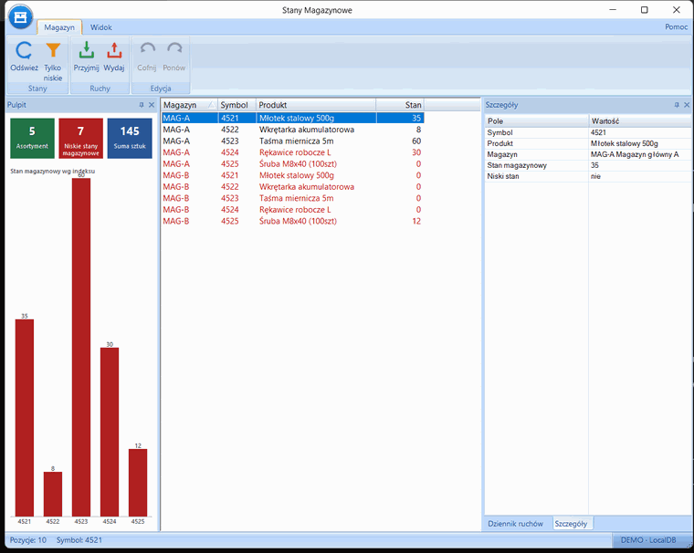
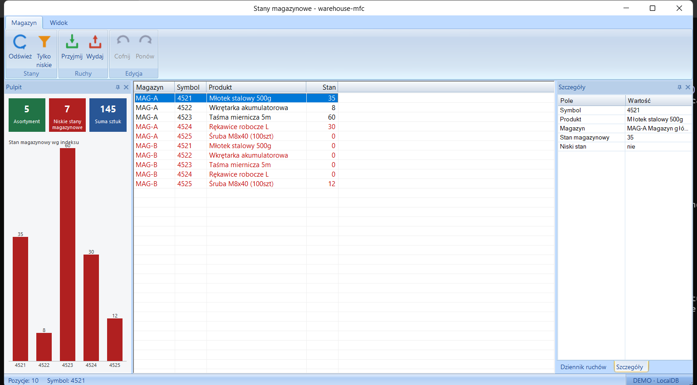
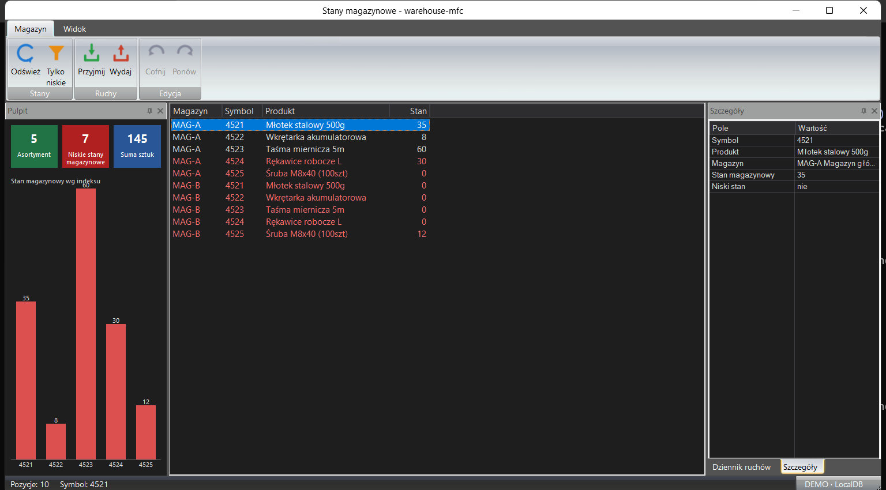
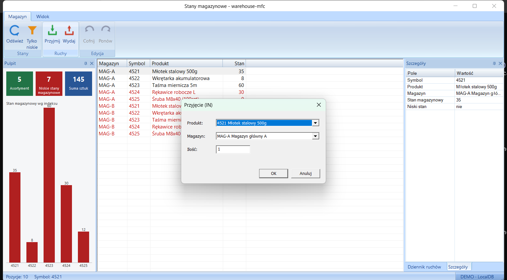

# Warehouse MFC

[English](README.md) | **Polski**

[](https://github.com/makflint/warehouse-mfc/actions/workflows/ci.yml)
[](docs/TESTING.md)
[](LICENSE)

Działająca aplikacja desktopowa **MFC + SQL Server (LocalDB)** do śledzenia stanów i ruchów
magazynowych. Interfejs to MFC Feature Pack w stylu Office (wstążka, dokowalne panele, pulpit
dopasowany do motywu), a każdą zmianę da się cofnąć dzięki wzorcowi Command. Całość jest pomyślana
jako pokaz
programowania w MFC i na desktopie Windows.



<sub>Interfejs pokazany po polsku. Aplikacja działa też po angielsku ([to samo demo, angielski UI](docs/screenshots/demo-en.gif)); nazwy produktów i magazynów zostają polskie, bo to dane z bazy.</sub>

## Co pokazuje
- **MFC**: architektura dokument/widok (SDI), tabelka (list-view), okna dialogowe z DDX/DDV.
- **MS SQL Server**: prawdziwy schemat z elementami SQL-a takimi jak widok z agregacją
  (`vCurrentStock`), procedura składowana działająca w transakcji (`sp_RecordMovement`) oraz
  mechanizmy integralności danych (klucze obce, `CHECK`, `UNIQUE`).
- **Wzorce projektowe**: wzorzec Command do cofania i ponawiania.
- **Testowalny rdzeń**: logika domenowa (matematyka stanów, stos Command/undo) żyje w czystej
  bibliotece C++ `core/`, testowanej Catch2 i bez GUI.
- **Feature Pack UI**: `CMFCRibbonBar`, dokowalne panele, motywy menedżera wizualnego (tryb ciemny)
  i ręcznie rysowany pulpit (kafelki informacyjne plus wykres słupkowy).
- **Dwujęzyczność i poprawny Unicode**: interfejs jest po polsku i angielsku. Mały katalog napisów
  (`I18n`) wybiera język z ustawień języka Windows przy pierwszym uruchomieniu, a przełącznik
  Język / Language na wstążce zmienia go po restarcie. Nazwy produktów i komunikat błędu z SQL
  Servera zostają polskie, bo to dane. Polskie znaki działają od początku do końca: zasoby `.cpp`/`.rc`
  są w UTF-8, a wywołania ODBC używają szerokiego API (`SQLExecDirectW`, literały `N'…'`, `NVARCHAR`),
  więc nazwy z danych startowych jak *Młotek*, *Wkrętarka* czy *Śruba* pokazują się w interfejsie poprawnie.

## Zrzuty ekranu


Interfejs MFC Feature Pack. Wstążka ma ikony na zakładkach Magazyn i Widok. Ręcznie rysowany
panel Pulpit pokazuje kafelki informacyjne i wykres słupkowy stanu, tabelka rysuje wiersze z niskim
stanem na czerwono, a panele Szczegóły i Dziennik ruchów znajdują się w jednej grupie zakładek. Na dole
`CMFCRibbonStatusBar` pokazuje liczbę pozycji, wybrany symbol i profil połączenia.

| Tryb ciemny (Widok → Motyw → Ciemny) | Zapis ruchu (DDX/DDV) |
|---|---|
|  |  |

Stan magazynowy wynika z sumowania ruchów, czyli przyjęć i wydań z magazynu, a wiersze z niskim
stanem rysowane są na czerwono. Zapis ruchu przechodzi przez stos Command (cofnij/ponów,
Ctrl+Z/Ctrl+Y), a pulpit odrysowuje się na żywo.

## Architektura
Kod dzieli się na trzy warstwy ze ścisłymi granicami. Logika testowalna jest oddzielona od GUI, więc
da się ją testować bezpośrednio, bez interfejsu. Zależności biegną w dół, ku `core/`, i żadne reguły
biznesowe nie żyją w `app/`.

```
app/    MFC Feature Pack — dokument/widok, wstążka, dokowalne panele, ręcznie
        rysowany pulpit, dialogi DDX/DDV, katalog i18n, motywy menedżera wizualnego
  │     (spina warstwy poniżej; nie trzyma logiki biznesowej)
  ▼
data/   cienki ODBC — StockRepository (pImpl) nad vCurrentStock + sp_RecordMovement
  │
  ▼
core/   czysty C++17 (bez MFC / ODBC / Windows) — matematyka stanów, stos Command/undo,
        logika sortowania tabelki i czyszczenia błędów, testy jednostkowe (Catch2)
```

- [`core/`](core/include/warehouse/) to warstwa domenowa: `MovementCommand` i `CommandStack`
  (cofanie/ponawianie przez ruchy kompensujące), `StockMath`, funkcje pomocnicze do sortowania tabelki i preselekcji
  w oknie dialogowym (`view_logic.hpp`) oraz czyszczenie błędów ODBC (`db_error.hpp`). Nie wciąga żadnych
  nagłówków frameworka, więc testuje się bez GUI.
- [`data/`](data/include/warehouse/) to cienka nakładka na ODBC: `StockRepository` (pImpl) nad
  widokiem i procedurą składowaną, z parametrami połączenia z `connection_profiles.hpp`.
- [`app/`](app/) to interfejs MFC i spina `core` z `data`. Trzymanie logiki w `core/` bez GUI jest
  tym, co umożliwia pracę sterowaną testami i mierzenie pokrycia.

## Techniki C++ / Windows w akcji
| Obszar | Co |
|---|---|
| **Wzorce** | Command (cofnij/ponów, operacje kompensujące); pImpl (`StockRepository`); RAII z jasną własnością (`std::unique_ptr`, MFC `CDC`/`CFont`); wymuszone granice warstw |
| **MFC Feature Pack** | `CMFCRibbonBar`, `CDockablePane`, `CMFCListCtrl`, `CMFCPropertyGridCtrl`, `CMFCVisualManager` (w tym własny menedżer ciemnego motywu kolorystycznego); ręcznie rysowany, podwójnie buforowany pulpit; ciemny pasek tytułu przez DWM |
| **Dane / SQL** | szerokie API ODBC (`SQLExecDirectW`, `NVARCHAR`, `N'…'`) dla pełnego Unicode; widok plus procedura składowana w transakcji (`UPDLOCK/HOLDLOCK`, `THROW` przy zejściu poniżej zera) |
| **i18n** | katalog napisów PL/EN sprawdzany pod kątem spójności w czasie kompilacji (`static_assert` na wyliczonym rozmiarze tablicy) |
| **Testy** | TDD (Catch2; pokrycie linii `core/` przez OpenCppCoverage); międzyprocesowy zestaw asercji UI Automation + Win32; skryptowany przegląd wizualny |
| **Narzędzia** | `/W4 /WX` (nagłówki MFC wyciszone jako zewnętrzne); czysty clang-tidy; lokalne CI jedną komendą ([`run-tests.ps1`](run-tests.ps1)) |

## Połączenie z SQL Server
Aplikacja rozmawia z SQL Serverem wyłącznie przez ODBC (żadnego web ani HTTP w C++). Domyślnie używa
LocalDB, który nie wymaga konfiguracji i sam wypełnia bazę przy pierwszym uruchomieniu. LocalDB to
ten sam silnik co pełny SQL Server, więc skierowanie go na prawdziwą instancję (maszyna w LAN, VPS
przez Tailscale czy Azure SQL) to zmiana jednej linijki `Server=` w
[`connection_profiles.hpp`](data/include/warehouse/connection_profiles.hpp).

## Szybki start

### 1. Wymagania (wszystko darmowe)
1. **Visual Studio Community 2022**, z obciążeniem *Desktop development with C++* i opcjonalnym
   komponentem *C++ MFC for latest v143 build tools*.
2. **SQL Server 2022 Express** (zawiera LocalDB), plus SSMS.

To wszystko, czego potrzeba, żeby zbudować, uruchomić i przetestować aplikację. Jeden opcjonalny
dodatek: przegląd wizualny może udostępnić swoje zrzuty ekranu do CLI [`claude`](https://claude.com/claude-code)
na ocenę przez AI (`run-tests.ps1 -AiReview`). Nie jest wymagany. Bez niego po prostu oglądasz
wygląd GUI na oko, a wszystkie grupy testów i tak są uruchamiane.

### 2. Jedna komenda (build → testy → instalator)
Jeden skrypt buduje wersje Debug i Release, uruchamia grupy testów i tworzy instalator:
```powershell
git clone https://github.com/makflint/warehouse-mfc.git
cd warehouse-mfc
powershell -File release.ps1            # dodaj -NoSweep, aby pominąć wolne przeglądy wizualne
```
Zatrzymuje się przed budową instalatora, jeśli którakolwiek grupa testów padnie. Oto co powstaje:

| Artefakt | Lokalizacja |
|---|---|
| Wyniki testów | konsola: wynik każdej grupy testów; przebieg kończy się kodem ≠ 0, jeśli któraś padnie |
| Plik aplikacji (Release, x64) | `app\x64\Release\app.exe` |
| Instalator | `installer\Output\WarehouseMFC-Setup.exe` |

Nic nie publikuje; wypchnij wydanie na GitHubie ręcznie przez `gh`, gdy zechcesz.

## Testy (lokalne CI)
Testy mają trzy warstwy: testy jednostkowe (`core/`, TDD z Catch2), zestaw asercji UI
([`tests/ui/`](tests/ui/), Pester plus UI Automation sterujące działającą aplikacją) i przegląd
wizualny ([`tests/manual/`](tests/manual/)) dla przypadków, które naprawdę wymagają ludzkiego oka.
Jeden skrypt uruchamia całą trójkę na LocalDB, a jego kod wyjścia to liczba grup testów, które padły:
```powershell
powershell -File run-tests.ps1          # -Build najpierw buduje · -Coverage · -AiReview
```
Pokrycie linii dla `core/` mierzy OpenCppCoverage na wersji Debug `core_tests` (uruchom
`run-tests.ps1 -Coverage`; raporty HTML i Cobertura lądują w `coverage/`). Pełna metodologia i lista
przypadków jest w [docs/TESTING.md](docs/TESTING.md).

## Pobranie
Pobierz `WarehouseMFC-Setup.exe` z [release v1.1](https://github.com/makflint/warehouse-mfc/releases/tag/v1.1)
i uruchom na czystej maszynie z Windows. Instalator [Inno Setup](installer/warehouse-mfc.iss) pakuje
aplikację, skrypty SQL oraz runtime VC++ i LocalDB, a aplikacja wypełnia bazę przy pierwszym
uruchomieniu, więc nic nie trzeba instalować wcześniej. Wersja jest niepodpisana, więc SmartScreen
ostrzeże za pierwszym razem: wybierz *More info* → *Run anyway*. Żeby zbudować instalator samodzielnie,
użyj `release.ps1` powyżej.

Zajrzyj do [docs/SPEC.md](docs/SPEC.md) po projekt i do [TODO.md](TODO.md) po plany i otwarte zadania.

## Autor
Zbudował Maciej Krzemiński. Przy projektowaniu, pisaniu kodu i testach wspierałem się narzędziami
Claude — [Claude Code](https://claude.com/claude-code) oraz modelami Claude od Anthropic.

## Licencja
[MIT](LICENSE) © Maciej Krzemiński
